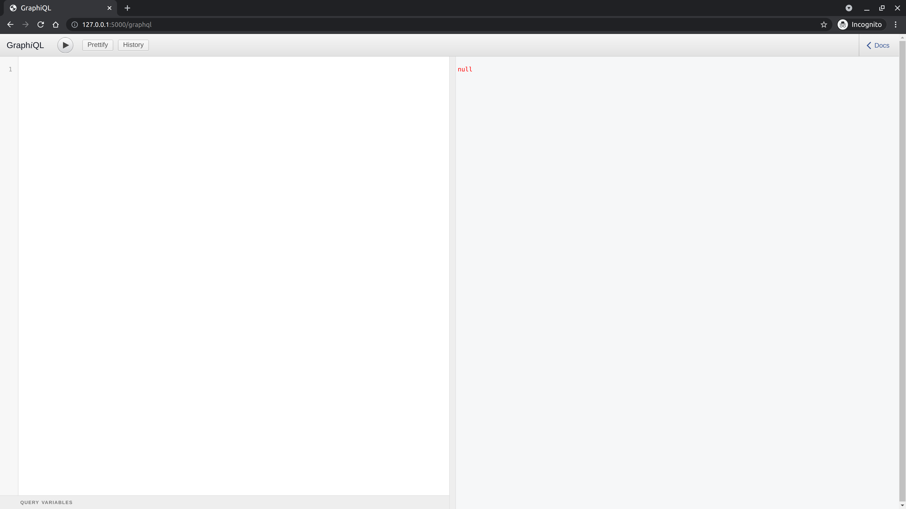

# GraphQL API with Python
## [Flask](https://github.com/pallets/flask) and [Graphene](https://github.com/graphql-python/graphene)


This is an API built for the purpose of studying the GraphQL technology and its integration with Python and the Flask framework.
The library Graphene was used to build it.

---

## Summary

1. [What is the API?](#What-is-the-API?)
2. [How to run the project](#How-to-run-the-project)
3. [API Docs](#API-Docs)
   1. [User](#User)
   2. [Post](#Post)
   3. [Queries](#Queries)
      1. [getAllPosts](#getAllPosts)
      2. [getAllUsers](#getAllUsers)
      3. [getPost](#getPost)
      4. [getUser](#getUser)
   4. [Mutations](#Mutations)
      1. [CreatePost](#CreatePost)
      2. [UpdatePost](#UpdatePost)
      3. [DeletePost](#DeletePost)
      4. [CreateUser](#CreateUser)
      5. [UpdateUser](#UpdateUser)
      6. [DeleteUser](#DeleteUser)


## What is the API?

This API has two main models: Users and Posts. So, basically the goal here is to create a CRUD for them.
It will also be possible to link a post to a user (its creator, in this case).

## How to run the project

Go into your work directory and clone this repository:

```bash
$ git clone git@github.com:vitumenezes/flask-with-graphql.git
```

Now you will need to create a virtual environment to correctly run the projet.

There are differents ways to do it, here we will use the standard python lib called **venv**.

The virtualenv will be created in a folder. And where, leave it?
I suggest creating it with a "." in front of the name, for example: **.venv**.
And create it **inside** the project folder, so we know that that virtual environment belongs to the project itself.
It's just a pattern and there are several, use whichever you prefer.

Enter the folder:

```bash
$ cd flask-with-graphql
```

Create the virtual environment:
```bash
$ python -m venv .venv
```
> Use Python 3 versions to run this project. You can manage them with [Pyenv](https://github.com/pyenv/pyenv) ;)

Now, activate it:
```bash
$ source .venv/bin/activate
```

After that, you will now see the active prefix on your terminal:
```bash
(.venv) user@hostname$
```

> This means that the virtualenv is active.
Make shure it is always active while using the project for development purposes.

Now, install the depedencies on requirements.txt:
Enter a python interpreter of your choice and import the **SQLAlchemy** instance from the **main.py** file

Before running the project, we first need to create the tables in our sqlite database.
Enter a python interpreter of your choice and import the **SQLAlchemy** (called **db**) instance from the **main.py** file.
```bash
(.venv) $ python

...

>>> from main import db
>>> db.create_all()
```

Now, run it:
```bash
(.venv) $ python main.py runserver
```

Access http://127.0.0.1:5000/graphql to see the interface to write and test **graphql** queries.



# API Docs

As stated earlier, there are two base models in the API.

## User
Represents the User template to be saved in the database.

Fields:

**uuid**: ID!<br/>
_The User identifier. Autofilled_

**username**: String<br/>
_The User username. Must be unique_

**password**: String<br/>
_The User password_

**posts**: [PostType]<br/>
_The User's posts_


## Post
Represents the Post template to be saved in the database.

Fields:

**uuid**: ID!<br/>
_The Posti identifier. Autofilled_

**title**: String<br/>
_The Post title_

**body**: String<br/>
_The Post body (content)_

**authorId**: Int<br/>
_The Post creator identifier_

**author**: UserType<br/>
_The user who created the post itself_

---

>The API offers Create, Update and Delete mutations for User and Post, that is, 6 mutations in total.
There are also queries to fetch one or all rows from each model's database table (User and Post).

## Queries

### getAllPosts
```
{
  getAllPosts {
    uuid
    title
    body
    authorId
    author
  }
}
```
Returns all posts from the database.

**PARAMS**:<br/>
not needed

**FIELDS**:<br/>
All fields from Post<br/>
The field _**author**_ has all fields of User.


Example of usage:
```
{
  getAllPosts {
    title
    body
    authorId
  }
}


```
Example of return:
```json
{
  "data": {
    "getAllPosts": [
      {
        "title": "Some title",
        "body": "content",
        "authorId": 2
      },
      {
        "title": "Title",
        "body": "Some Body",
        "authorId": 7
      },
      {
        "title": "title",
        "body": "body",
        "authorId": 2
      },
      {
        "title": "Nice Title",
        "body": "Cooooteeeennnnt",
        "authorId": 4
      }
    ]
  }
}
```

### getAllUsers
```
{
  getAllUsers {
    uuid
    username
    password
    posts
  }
}
```

Returns all users from the database.

**PARAMS**:<br/>
_not needed_

**FIELDS**:<br/>
_All fields from User<br/>
The field **posts** has all fields of Post._

Example of usage:
```
{
  getAllPosts {
    username
    posts {
      title
    }
  }
}

```
Example of return:
```json
{
  "data": {
    "getAllUsers": [
      {
        "username": "edu",
        "posts": [
          {
            "title": "Some title"
          },
          {
            "title": "title"
          }
        ]
      },
      {
        "username": "luiz",
        "posts": []
      },
      {
        "username": "lupa",
        "posts": [
          {
            "title": "Nice Title"
          },
          {
            "title": "mvmwdivotu"
          }
        ]
      }
    ]
  } 
}
```

### getPost
Returns data from a single user.

**PARAMS**:<br/>
**post_id**: _The Post ID_

**FIELDS**:<br/>
_All fields from Post_<br/>
_The field **author** has all User fields._

Example of usage:
```
{
  getUser(userId: 2) {
    username
    posts {
      title
    }
  }
}
```
Example of return:
```json
{
  "data": {
    "getPost": {
      "title": "Title",
      "body": "Some Body"
    }
  }
}
```

### getUser
Returns data from a single user.

**PARAMS**:<br/>
**user_id**: _The User ID_

**FIELDS**:<br/>
_All fields from User<br/>
The field **posts** has all Post fields._

Example of usage:
```
{
  getUser(userId: 2) {
    username
    posts {
      title
    }
  }
}
```
Example of return:
```json
{
"data": {
  "getUser": {
    "username": "edu",
      "posts": [
        {
          "title": "Some title"
        },
        {
          "title": "title"
        }
      ]
    }
  }
}
```

## Mutations

### CreatePost
Creates a new Post.

**PARAMS:**<br/>
**title**: _The Post title_<br/>
**body**: _The Post content_<br/>
**username**: _The username of the user who created the post_

**FIELDS:**<br/>
**ok**: _True or False. Informs if the request went well_<br/>
**message**: _A message stating the status of the request_<br/>
**post**: _The post created. Has all Post fields_

Example of usage:
```
mutation {
  CreatePost (title: "Some Title", body: "Some content", username: "edu") {
    ok
    message
    post {
      uuid
    }
  }
}
```
Example of return:
```json
{
  "data": {
    "CreatePost": {
      "ok": true,
      "message": "Post criado",
      "post": {
        "uuid": "10"
      }
    }
  }
}
```

### UpdatePost
Updates an existing Post.

**PARAMS:**<br/>
**postId**: _The Post identifier. Required_<br/>
**title**: _The new Post title. Not required_<br/>
**body**: _The new Post body. Not required_

**FIELDS:**<br/>
**ok**: _True or False. Informs if the request went well_<br/>
**message**: _A message stating the status of the request_<br/>
**post**: _The post updated. Has all Post fields_

Example of usage:
```
mutation {
  UpdatePost (postId: 3, title: "Some new Title", body: "Some new content") {
    ok
    message
    post {
      uuid
      title
      body
    }
  }
}
```
Example of return:
```json
{
  "data": {
    "UpdatePost": {
      "ok": true,
      "message": "Post atualizado",
      "post": {
        "uuid": "3",
        "title": "Some new Title",
        "body": "Some new content"
      }
    }
  }
}
```

### DeletePost
Deletes an existing Post.

**PARAMS:**<br/>
**postId**: _The Post identifier. Required_<br/>

**FIELDS:**<br/>
**ok**: _True or False. Informs if the request went well_<br/>
**message**: _A message stating the status of the request_<br/>

Example of usage:
```
mutation {
  DeletePost (postId: 3) {
    ok
    message
  }
}
```
Example of return:
```json
{
  "data": {
    "DeletePost": {
      "ok": true,
      "message": "Post removido com sucesso."
    }
  }
}
```

### CreateUser
Creates a new User.

**PARAMS:**<br/>
**username**: _The User username_<br/>
**password**: _The User password_<br/>

**FIELDS:**<br/>
**ok**: _True or False. Informs if the request went well_<br/>
**message**: _A message stating the status of the request_<br/>
**post**: _The Post created. Has all Post fields_

Example of usage:
```
mutation {
  CreatePost (username: "joe", password: "strongpassword") {
    ok
    message
    user {
      uuid
      username
    }
  }
}
```
Example of return:
```json
{
  "data": {
    "CreateUser": {
      "ok": true,
      "message": "Criado com sucesso",
      "user": {
        "uuid": "8",
        "username": "joe"
      }
    }
  }
}
```

### UpdateUser
Updates an existing User.

**PARAMS:**<br/>
**postId**: _The User identifier. Required_<br/>
**username**: _The new User username. Not required_<br/>
**password**: _The new User password. Not required_

**FIELDS:**<br/>
**ok**: _True or False. Informs if the request went well_<br/>
**message**: _A message stating the status of the request_<br/>
**post**: _The User updated. Has all User fields_

Example of usage:
```
mutation {
  UpdateUser (userId: 3, username: "joh doe", password: "newstrongpassword") {
    ok
    message
    user {
      uuid
      username
      password
    }
  }
}
```
Example of return:
```json
{
  "data": {
    "UpdateUser": {
      "ok": true,
      "message": "Usuário atualizado",
      "user": {
        "uuid": "3",
        "username": "joh doe",
        "password": "newstrongpassword"
      }
    }
  }
}
```

### DeleteUser
Deletes an existing User.

**PARAMS:**<br/>
**postId**: _The User identifier. Required_<br/>

**FIELDS:**<br/>
**ok**: _True or False. Informs if the request went well_<br/>
**message**: _A message stating the status of the request_<br/>

Example of usage:
```
mutation {
  DeleteUser (userId: 3) {
    ok
    message
  }
}
```
Example of return:
```json
{
  "data": {
    "DeleteUser": {
      "ok": true,
      "message": "Usuário removido com sucesso."
    }
  }
}
```

